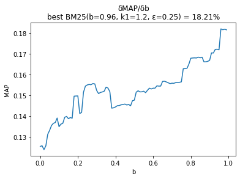
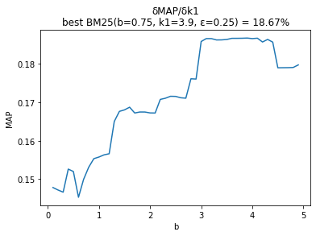

# Legal Case Retrieval System (AILA 2019)

## About
This repository implements a sophisticated information retrieval pipeline designed to match legal queries to the most relevant prior cases using the AILA 2019 dataset. The project is a technical journey in NLP, evolving from simple set-based similarity to a tuned probabilistic ranking model. It is particularly interesting because it tackles the inherent noise and specificity of legal terminology, utilizing a progression of techniques—from Jaccard coefficients and BM25 to data augmentation and synonym expansion—to optimize retrieval precision.

## Technical Details
The system evaluates retrieval performance using Average Precision (AP) and Mean Average Precision (MAP). The core logic transitions through several stages of complexity:

1. **Jaccard Similarity**: Initial baseline using the Jaccard Coefficient to measure the overlap between query and document sets.
2. **BM25 (Best Matching 25)**: A probabilistic retrieval function that improves upon TF-IDF by incorporating document length normalization and term frequency saturation. The score for a document $D$ given a query $Q$ is calculated as:
   $$\text{score}(D, Q) = \sum_{q \in Q} \text{IDF}(q) \cdot \frac{f(q, D) \cdot (k_1 + 1)}{f(q, D) + k_1(1 - b + b \cdot \frac{|D|}{\text{avgdl}})}$$
   Where:
   - $f(q, D)$ is the term frequency.
   - $|D|$ is the document length and $\text{avgdl}$ is the average document length across the corpus.
   - $k_1$ and $b$ are hyperparameters tuned to optimize the MAP.
3. **Data Augmentation**: Use of translation and expansion techniques to increase the robustness of the dataset.
4. **Fuzzy Matching**: Implementation of Levenshtein Distance to handle typographical errors and textual variations.
5. **Synonym Integration**: Enhancing the BM25 model by expanding query terms with synonyms to overcome the vocabulary mismatch problem.

The project includes empirical analysis of hyperparameter sensitivity, as seen in the following plots:

## Execution
The repository is structured as a sequential pipeline. To reproduce the results, execute the components in the following order:

1. **Baseline**: Run `1_Jaccard_Scores/Jaccard.ipynb` to establish the initial similarity scores.
2. **Probabilistic Retrieval**: Use `2_BM25/BM25.py` or the accompanying notebooks to implement and tune the BM25 model.
3. **Augmentation**: Execute `3_Augment_Data/augment.ipynb` to apply data expansion.
4. **Refinement**: Follow the sequence through `4_Levenshtein_Distance`, `5_Disruptive_Reduction`, and `6_BM25_Consider_Synonyms` to reach the final refined state.
5. **Evaluation**: Use `map.ipynb` to calculate the final Mean Average Precision across all queries.

**Requirements:**
- Python 3.x
- NumPy
- NLTK
- Matplotlib
- Jupyter Notebook